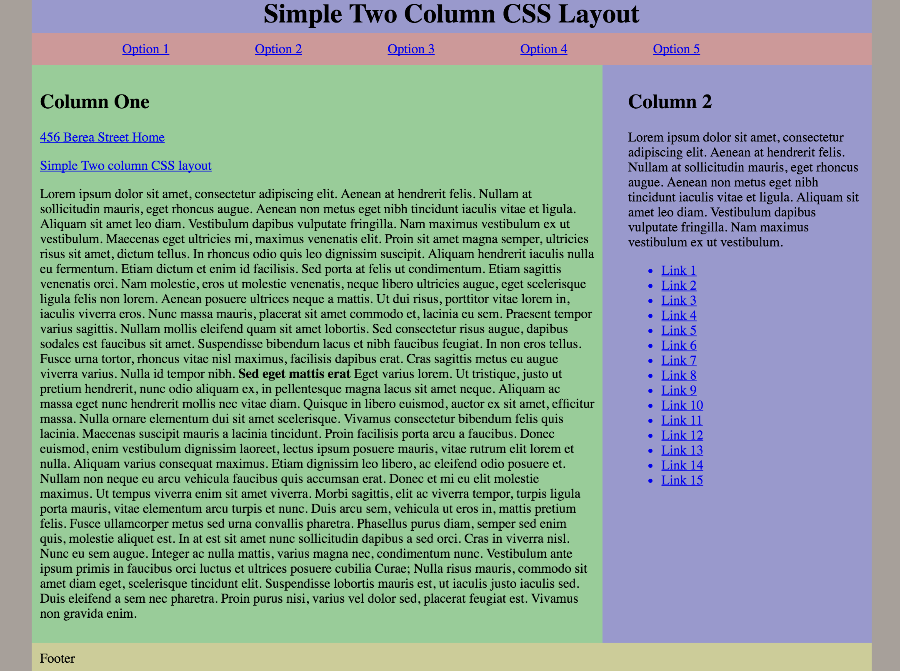

# _CSS Float Practice_

#### By _Kyle Lange and Garrett Price_

## Description

_A project to practice 2 column layout using float and clear._

## Setup/Installation Requirements

* _Copy the repository from GitHub_
* _Open in code editor of your choice_
* _Change the project name (and other info as necessary) in the package.json and bower.json files_
* _Run npm install_
* _run bower install_
* _run gulp build to build the project for the first time and gulp serve to start the development server_

## Technologies Used

* HTML5
* CSS3

## Known Bugs

_{no known bugs at this time}_

## Support and contact details

For questions, concerns, or suggestions please email baronsintrees@gmail.com

### License

*{Determine the license under which this application can be used.  See below for more details on licensing.}*

Copyright (c) 2016 **_Kyle Lange & Garrett Price_**
